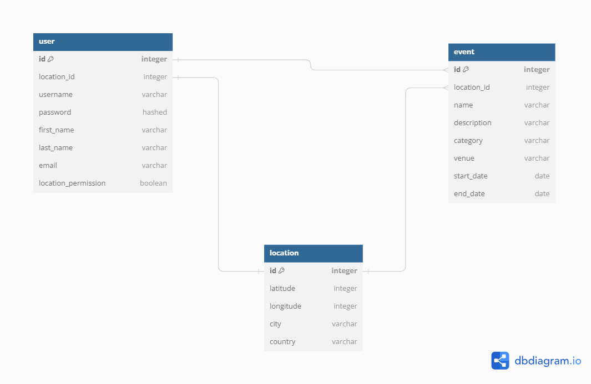

# Project Proposal: EventSpotter

## Summary

This app finds local entertainment based on a user's location and preferences. The idea is that, if a user chooses to, they may enter their location and then search for fun things to do near them based on filter criteria. Even if a user chooses not to enter their location, there is still the option to manually enter a city/location and search for local entertainment that way. 

| Tech Stack | 
Frontend: React, Bootstrap |
Backend: Node.js

| Type | 
Web application.

| Goal | 
Easily find local entertainment - an overarching idea is to give the user as much control over their experience as possible. The information is already out there, but the point of this app is to make the information easily obtainable however the user feels most comfortable. Some people are not keen on the idea of giving their location through a device.

| User Demographic | 
Anyone, but this app may be especially useful for those travelling/vacationing to new places and are looking for fun things to do.

| Initial Data Ideas | 
- User location: Google Maps Geolocation API
- Entertainment: Eventbrite API, Ticketmaster Discovery API, Eventful API are just a few of several free APIs that may be helpful for finding fun things to do.

## Initial Ideas

### Schema

Rough first draft - subject to change. 

### Potential API Issues 
An API may be down/unavailable and/or there may be rate limits.

### Sensitive Information 
Sensitive information to be secured includes a user's password and location. The location is only meant to be helpful for the individual user - it is not meant to be accessible by other users.

### Functionality 
- User location that is completely optional.
- Entertainment searches: There will be several ways to filter this information such as by event category (music concerts, festivals, sports events, comedy shows, theater, etc.), date/time, location radius, and (hopefully) ticket availability as well as pricing.

### User Flow 
1. Create account/login to an existing account
2. Give permission to use location, search for fun! 
   
   Or, 
   
3. Deny permission to use location
4. Enter a location of the user's choosing
5. Search for fun! 

### Stretch Goals 
- Include ticket availability and/or pricing.
- Algorithm to track a user's preferences.
- Consider developing a mobile app version for better accessibility.